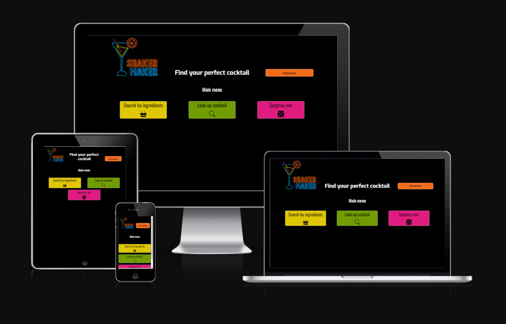
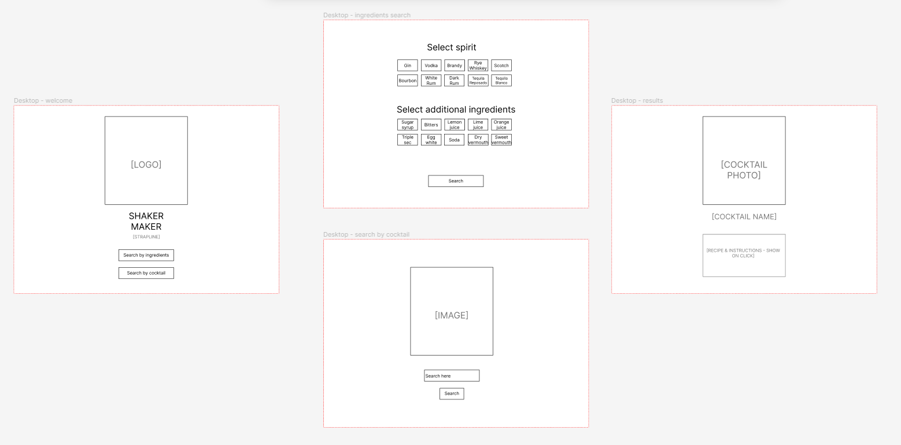
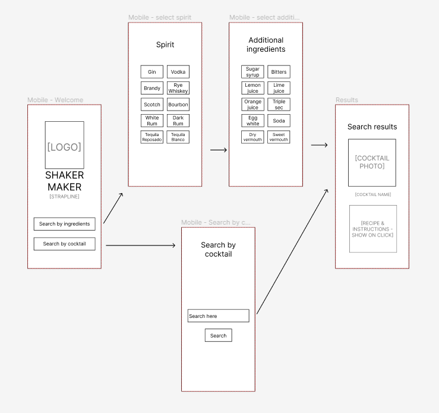
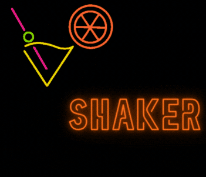
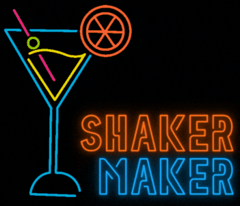
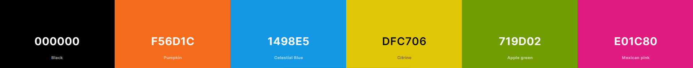
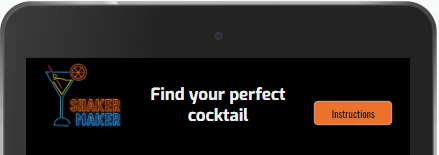
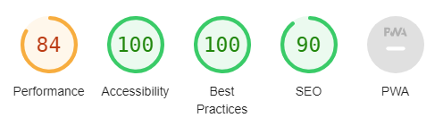

# Shaker Maker Website

This project creates a web-based cocktail finder application called ShakerMaker, allowing users to search cocktail recipes using a variety of methods. It is designed to be responsive and accessible on a range of devices, making it easy to navigate for users.

[View the live project here](https://nicksmith100.github.io/shakermaker/)

## Project Goals

### Purpose

A web-based cocktail finder application which allows users to search cocktail recipes using a variety of methods.

### Client Goals

This project aims to demonstrate and embed my understanding of JavaScript as part of my personal development. As such there is no specific client, but I have built it with the following goals in mind from a client perspective:

- Create a fun and engaging site which provides users with information about cocktails while generating interest in the topic
- Provide a cocktail finder service which returns results based on selected ingredients 
- Provide a cocktail search service which returns results based on cocktail name
- Provide a random cocktail service which returns a random cocktail recipe

### User Goals

As a **First Time Visitor**, I want to:
- Understand what the site offers
- Learn how to use the site to find cocktail recipes
- Easily navigate throughout the site to find the information I need

As a **Returning Visitor**, I want to:

- Use the site to find various cocktail recipes
- Explore different methods for finding cocktail recipes
      
## Research

### Cocktail recipes

Before embarking on the project I wanted to be sure that I could obtain cocktail recipes from a reliable source, having little knowledge of the subject myself. After some research I discovered [TheCocktailDB](https://www.thecocktaildb.com/) - an open, crowd-sourced database of drinks and cocktails from around the world with a [free JSON API](https://www.thecocktaildb.com/api.php). I conducted some intial testing and determined that the full version of the API would provide the necessary functionality to satisfy the project goals outlined above. (See **Technologies Used** section below for more details.)

### Popular ingredients

From my initial testing of the API it became clear that there were a vast number of ingredients provided by the database, such that listing them all for selection would detract from the user experience. I resolved to include only the 12 most popular spirits and the 30 most popular additional ingredients, using the list provided on this website as a guide: [Difford's Guide - Top 100 Cocktail Ingredients](https://www.diffordsguide.com/encyclopedia/1045/cocktails/top-100-cocktail-ingredients).

### Existing cocktail recipe finder websites

I researched existing cocktail recipe finder websites to determine what was already available to potential users of my site. Results included:

- [Difford's Guide - Cocktail Finder](https://www.diffordsguide.com/cocktails/search): A well-presented and sophisticated search engine offering various ways to search, including multiple ingredient dropdowns and the option to search by keyword. The site offers maximum functionality but arguably risks overwhelming less experienced cocktail makers.
- [Cocktail Builder](https://www.cocktailbuilder.com/): Offers a "shopping list" of ingredients, allowing the user to select which ones they have and which they don't. The site provides a live update of cocktails which can be made with the selected ingredients, as well as other cocktails which have one or more ingredients missing. The site offers good functionality with a simple interface and straightforward results, but the styling is quite basic.
- [Epicurious Interactive Cocktail Cabinet](https://www.epicurious.com/recipes-menus/cocktail-recipe-finder-article): Provides an excellent, user-friendly interface with images of spirits and other ingredients to be selected. As ingredients are selected, the interface adapts to indicate which other ingredients remain available for selection using a spider-diagram effect, indicating how many recipes exist with the selected ingredients. Clicking on a recipe title and image opens a new tab with the recipe, seemingly to drive traffic to other parts of the website, which arguably detracts from the user experience.

## User Stories

Based on the research and project goals outlined above, I envisage the site being visited by casual cocktail makers with no expert knowledge, as well as more experienced cocktail makers who know what they are looking for but need to confirm the ingredients. User stories may differ depending on the experience of the user and whether they are a first-time or returning visitor. 

1. As a casual cocktail maker I want to:
      a. Find out what cocktails I can make with the ingredients I have available.
      b. Search for cocktails I have heard of and/or tried previously.
      c. Discover cocktails I am not already aware of.
  
2. As an experienced cocktail maker I want to:  
      a. Remind myself of cocktails which can be made with the ingredients I have available.
      b. Search for a particular cocktail recipe to confirm the ingredients and method.
      c. Discover cocktails I am not already aware of.
      d. Revisit cocktails I have not made recently.

3. As a first-time visitor (regardless of experience) I want to: 
      a. Understand what the site offers
      b. Learn how to use the site to find cocktail recipes
      c. Easily navigate throughout the site to find the information I need

4. As a returning visitor (regardless of experience) I want to: 
      a. Use the site to find various cocktail recipes
      b. Explore different methods for finding cocktail recipes

## Design

### Wireframes

Wireframes were created using the Figma platform: [Figma - ShakerMaker](https://www.figma.com/file/kkJOk17MsggqClsHPMeO5I/Shaker-Maker?type=design&node-id=0%3A1&mode=design&t=gZj3N4u4m5Y8Abjo-1).

- #### Desktop Wireframes

  

- #### Mobile Wireframes

  

Based on prior experience I decided that desktop and mobile wireframes would be sufficient to keep the overall layout of the site on track, the expectation being that [Bootstrap's grid system](https://getbootstrap.com/docs/5.3/layout/grid/) would provide the responsiveness required at different device breakpoints (see **Layout and Styling** section below).

While the overall structure of the site stays true to the wireframes, there are some notable differences in the final layout which came about for design and user experience reasons:

- For design purposes I opted to provide a welcome screen with an animated version of the logo, which disappears after 2 seconds and gives way to the main site.
- I added a header, to provide a space for the logo to maintain consistent branding throughout the user experience, and to provide a space for additional buttons (see below).
- To aid the user experience I added to the header an "Instructions" button, and a "Back to menu" button which appears on the results screen.
- To provide a fun, additional search option I added a random cocktail finder.

### Layout and Styling

The site uses the [Bootstrap 5.3 Grid system](https://getbootstrap.com/docs/5.3/layout/grid/) to ensure it is fully responsive on all device and viewport sizes. Bootstrap 5.3 uses the following [breakpoints](https://getbootstrap.com/docs/5.3/layout/breakpoints/), the shorthand references for which are used throughout the rest of this document:

    | Breakpoint        | Shorthand   | Dimensions |
    |-------------------|-------------|------------|
    | Extra small       | xs          | <576px     |
    | Small             | sm          | ≥576px     |
    | Medium            | md          | ≥768px     |
    | Large             | lg          | ≥992px     |
    | Extra large       | xl          | ≥1200px    |
    | Extra extra large | xxl         | ≥1400px    |

In addition, the site uses the following specific components from the Bootstrap library:
- The cocktail search form utilises Bootstrap's [Form classes](https://getbootstrap.com/docs/5.3/forms/overview/).
- The site utilises Bootstrap's [Modal plugin](https://getbootstrap.com/docs/5.3/components/modal/) to display instructions at the press of a button, and to provide various alerts.  
- For the most part I have used Bootstrap's utility classes for [spacing](https://getbootstrap.com/docs/5.3/utilities/spacing/) and [typography](https://getbootstrap.com/docs/5.3/content/typography/), ensuring the layout and font are appropriate to the device in use. 
- I have also used the Bootstrap [Display property](https://getbootstrap.com/docs/5.3/utilities/display/) to toggle the visibility of some components at certain breakpoints, in particular:
    -  In the header, removing the strapline "Find your perfect cocktail" on xs viewports.
    -  On the spirit selection page, including images in the buttons on sm viewports and above.

### Imagery

The **logo** is a neon representation of a cocktail glass on a black backgound, with the name of the site also represented in neon-style lettering. The logo is provided in bright colours to replicate a typical sign of a cocktail bar. On the welcome screen an animated version of the logo is displayed for a few seconds, while a static version is used in the header to avoid distracting the user.

    
    

The logo was created using a template by Carla Moreno on the Canva website: [Orange and Blue Neon Drinks Bar Animated Logo](https://www.canva.com/templates/EAFCXIroTmk-orange-and-blue-neon-drinks-bar-animated-logo/).

Images of relevant spirit bottles are shown on the spirit selection buttons for sm breakpoints and above, provided by [TheCocktailDB API](https://www.thecocktaildb.com/api.php).

Images of the cocktails themselves are shown on the results page, again provided by [TheCocktailDB API](https://www.thecocktaildb.com/api.php). Since the database is crowd-sourced, these images are submitted by users of the database.

Finally, the 404 page carries an image of an empty cocktail glass with an associated message.
       
### Colour Scheme

The colour scheme of the site builds on the main logo, utilising the five fluorescent colours for the various buttons, maintaining the cocktail bar aesthetic. The site is set on a black (#000000) background which provides the necessary contrast for the bright colours. Primary buttons utilise the orange colour (#f56d1c) from the logo, transitioning to blue (#1498e5) when hovered over, using an ease-in-out transition for a smooth effect. The other colours taken from the logo are yellow (#dfc706), green (#719d02) and pink (#e01c80). 

### Typography

- #### Logo

**PLACEHOLDER TEXT FROM HERE**

    

    - The font used for the title and navigation links is Desyrel, with Sans Serif as the fallback font.

    - Desyrel is a playful but stylish script font which reflects that the purpose of the company is to provide fun games.

    - The Desyrel font was downloaded from [Dafont](https://www.dafont.com/desyrel.font) as a TrueType font and converted to @font-face using [Transfonter](https://transfonter.org/).

  - ##### Other headings and text

    

    - The font used throughout the rest of the site is Playfair Display, with Serif as the fallback font.

    - Playfair Display is a classy, stylish serif font which provides a contrast to the playfulness of the heading font, demonstrating the professionalism of the company.

    - Playfair Display is imported from [Google Fonts](https://fonts.google.com/specimen/Playfair+Display).

- #### Icons

  - Icons are taken from the [Bootstrap Icons](https://icons.getbootstrap.com/) library and are utilised as classes in the `<i>` tag.
  
  - The icons inherit their styling from the anchor and list tags within which they are contained, for example inheriting font-size, color and hover effect.
  
  - Icons are utilised in the header for navigation list items and for the "hamburger" button on smaller viewports, and in the footer for social media links.

- #### Favicon

  - As a favicon, the site uses a simple "S" in the Desyrel font, using the dark green colour against a white background. This proved more effective than trying to use the main logo as a favicon, as the detail of it was lost at such a small size.
  
  - The favicon was generated using [Favicon Generator](https://www.favicon-generator.org/).

## Features

### Scope

- #### Minimum Viable Product

  - To be viable as a marketing website for the company, the website **must have**:
    1. Information on the products available to hire.
    2. Contact details to allow customers to reach the company and make bookings.
         
- #### Additional Features (in scope)

  - To provide a good user experience and meet the stated business needs of the company, the website also **should have**:
    1. Images of the products available to hire.
    2. An online booking form to allow customers to make bookings directly from the site.
    3. An "About page" to allow customers to connect to the origin story of the company.
    4. Quotes from previous customers to add legitimacy and build trust with customers.
    5. Social media links to add legitimacy and allow customers to connect through their preferred platform.
   
 - #### Future Ideas (not currently in scope)
  
    - To provide a better user experience and better meet the business needs of the company, the website also **could have**:
      1. Separate "Book Now" links for each package from the homepage, linking to the booking page while auto-selecting the relevant package from the dropdown menu in the booking form. 
      2. An up-to-date availability calendar, allowing customers to check whether the games are available on their chosen date.
      3. A fully end-to-end booking and payment system, allowing customers to book the games on their chosen date, make payment and receive a confirmation.
      4. A gallery of images from previous events, to add legitimacy and build trust with customers.

### Page Elements

The website includes the following page elements, in line with the scope outlined above. 

- #### All pages

  - ##### Header
         
    - All pages include a header with branding on the left-hand side and a navigation menu on the right-hand side. The header is fully responsive:
      - The title and logo are displayed as a single image on xs viewports.
      - On sm and md viewports, the logo and title are displayed separately with the title being stacked in three lines, while on lg viewports and above, the title displays as a single line.
      - The navigation menu collapses to a hamburger menu on xs viewports, but is otherwise displayed as a single line.
     
     - Desktop header
      
      
    
    - Tablet header
      
      
    
    - Mobile header
      
      
    
  - ##### Primary image
          
    - All pages include a primary image relevant to the content of the page. Each image uses [Bootstrap's .img-fluid class](https://getbootstrap.com/docs/5.3/content/images/#responsive-images) to ensure it is fully responsive, stretching across the full width of the viewport for xs viewports, or the full width of the container on sm viewports and above.
    
    - Primary image - desktop
      
      
      
    - Primary image - mobile
      
      
                
  - ##### Footer
       
    - All pages include a footer with three equally spaced and centred social media icons, linking to Instagram, Facebook and Whatsapp. The icons utilise automatic margins so that their spacing is reponsive to the viewport size. 
    
    - Desktop footer
      
      
      
    - Mobile footer
      
       

  - #### Homepage

    - The primary image on the homepage is overlaid with a box on the right-hand side which presents three quotes from previous customers on rotation, utilising Bootstrap's [Carousel](https://getbootstrap.com/docs/5.3/components/carousel/) component.
      
      
      
    - The quotes box disappears at the xs breakpoint as the text would either be too small to read or the box would dominate the primary image.
      
      
      
    - The main content of the homepage comprises two distinct sections:
      
      - A section outlining the hire packages on offer, each package including a specific number of games from each tier, along with a "Book Now" button.
      
        
        
        
              
      - A section illustrating the games in each tier, each tier including an image gallery using Bootstrap's [Carousel](https://getbootstrap.com/docs/5.3/components/carousel/) component, and a list of games along with descriptions. The captions for the gallery fade out after 2 seconds to avoid them dominating the images.
        
        
        
        
       
      - Both sections utilise Bootstrap's [Grid system](https://getbootstrap.com/docs/5.3/layout/grid/), ensuring that the content adjusts according to viewport size as shown above.
      
  - #### About page
      
      
    
    - The About page is the simplest of all the pages with no particular special features. It includes as its primary image a photograph of the owners of the company during their own wedding celebrations, accompanied by the story of how the company began.
                    
  - #### Booking page
  
      
    
    - The Booking page includes a booking form which allows customers to provide their contact details, event details, the package they wish to book and their selected games, and to submit these details to the company.
    - The form is arranged into sections for ease of understanding, and includes required fields which will prevent the form from being submitted unless they are completed.          
    - The form includes a modal to display booking terms and conditions at the press of a button, utilising Bootstrap's [Modal plugin](https://getbootstrap.com/docs/5.3/components/modal/).
      
      

## Technologies Used

### Languages
- [HTML](https://html.spec.whatwg.org/multipage/)
  - Standard markup language for web pages
- [CSS](https://www.w3.org/Style/CSS/)
  - Used to add style to HTML

### Frameworks
- [Bootstrap 5.3](https://getbootstrap.com/docs/5.3/getting-started/introduction/)
  - Used for overall layout and styling of page, as well as specific components as described above

### Libraries
- [Google Fonts](https://fonts.google.com)
  - Used for importing Playfair Display font
- [Dafont](https://dafont.com/)
  - Used to download Desyrel font
- [Bootstrap icons](https://icons.getbootstrap.com/)
  - Used for icons

### Platforms
- [Github](https://github.com/)
  - Used to store code remotely and for deployment
- [CodeAnywhere](https://app.codeanywhere.com/)
  - IDE used for project development

### Other Tools
- [Figma](https://www.figma.com/)
  - Used to create wireframes
- [Coolors](https://coolors.co/)
  - Used to create colour palette
- [Transfonter](https://transfonter.org/)
  - Used to convert TrueType font to @font-face 
- [Favicon Generator](https://www.favicon-generator.org/)
  - Used to create the website favicon
- [Am I Responsive](https://ui.dev/amiresponsive)
  - Used to create montage of different devices displaying the site

## Testing

### Validation

- [W3C Markup Validator](https://validator.w3.org/) returns no errors against any of the pages. (It does, however, return a minor warning against the booking.html page - see **Known Bugs** section.)
- [W3C CSS Validator](https://jigsaw.w3.org/css-validator/) returns no errors or warnings.

### Accessibility

- [Lighthouse accessibility](https://developer.chrome.com/docs/lighthouse/accessibility/) audit scores (accessed through Chrome DevTools) show that the site is fully accessible and complies with best practices.

  

### Manual Testing

- The Website was fully tested on the following browsers and devices, checking that all features and links worked correctly:

| Browser        | Version                                  | Device                                      | Operating Sytem       | Results                                                        |
|----------------|------------------------------------------|---------------------------------------------|-----------------------|----------------------------------------------------------------|
| Firefox        | 113.0.2 (64-bit)                         | Dell Latitude E6420 laptop                  | Windows 10 Home       | Fully functional                                               |
| Google Chrome  | 113.0.5672.127 (Official Build) (64-bit) | Dell Latitude E6420 laptop                  | Windows 10 Home       | Minor issue with form warnings - see **Known Bugs**            |
| Google Chrome  | 113.0.5672.127 (Official Build) (64-bit) | Microsoft Surface Pro 7 256GB               | Windows 10 Enterprise | Minor issue with form warnings - see **Known Bugs**            |
| Google Chrome  | 113.0.5672.162                           | Xiaomi Mi 10 Lite 5G                        | Android 12            | Minor issue with form warnings - see **Known Bugs**            |
| Google Chrome  | 113.0.5672.163                           | Huawei HONOR 20 Lite                        | Android 10            | Minor issue with form warnings - see **Known Bugs**            |
| Microsoft Edge | 114.0.1823.37 (Official build) (64-bit)  | Dell Latitude E6420 laptop                  | Windows 10 Home       | Minor issue with form warnings - see **Known Bugs**            |
| Microsoft Edge | 112.0.1722.39 (Official build) (64-bit)  | Microsoft Surface Pro 7 256GB               | Windows 10 Enterprise | Minor issue with form warnings - see **Known Bugs**            |
| Safari         | 16.5                                     | Apple iPad (9th generation) running         | iPadOS 16.5           | Minor issue with touch input on galleries - see **Known Bugs** |
| Safari         | 16.3.1                                   | Apple iPad Pro (12.9-inch) (4th generation) | iPadOS 16.3.1         | Minor issue with touch input on galleries - see **Known Bugs** |

### Fixed Bugs

- The quotes in the box overlaid on the hero image in the main page would not vertically centre using standard CSS such as automatic margins. This was fixed using the `translateY` function of the CSS property `transform` as detailed here: [How to vertically center a bootstrap carousel caption](https://stackoverflow.com/questions/27279865/how-to-vertically-center-a-bootstrap-carousel-caption).
- The dropdown selecter in the booking form had the `required` attribute, but was allowing the form to be submitted even if a value had not been selected. This was fixed by ensuring that the "Please select" option had an empty value, as detailed here: [Applying the required attribute to select fields](https://stackoverflow.com/questions/6048710/can-i-apply-the-required-attribute-to-select-fields-in-html).  

### Known Bugs

- On Google Chrome and Microsoft Edge browsers, if a required form field is not populated and the field is off screen when "Submit" is pressed, the browser jumps back to that field and highlights it, but does **not** display a warning to the user that the field must be filled in. This error does not occur on Firefox or Safari browsers. Despite extensive investigation, I have been unable to find the cause of this bug, and cannot determine if it is due to any fault in the code. This could be circumvented by separating the form into separate pages, but that is beyond the scope of this project.
- On touch devices, the image carousels do not react to swipe actions unless they have already been interacted with using the next button. Searching relevant forums suggests that adding `data-touch="true"` to the carousel div should solve this, but it does not. It appears that a workable solution may require JavaScript which is beyond the scope of this project.
- The Booking page returns a minor warning concerning two `<h1>` elements. Only one `<h1>` element is actually displayed at any one time, and the second one as been given the attribute `aria-hidden="true"` to avoid being read by screen readers, but the error remains. Oddly, the error is not returned on the other pages which all include the same code. As this is only a minor warning and not an error, it has not been investigated further at this stage.   

## Development and Deployment

### Git Commits

Early on in development, as I was still becoming familiar with the concept of Git, **my commits were very large with long messages**. My mentor spotted this during the midway project session and explained the need to commit regularly, with shorter messages. Later commits should demonstrate this change in approach.  

### GitHub Pages

The project was deployed to GitHub Pages using the following steps.

1. Log in to GitHub and locate the [GitHub Repository](https://github.com/nicksmith100/milestone-project-1/)
2. At the top of the Repository (not top of page), locate the "Settings" Button on the menu.
3. In the menu on the left-hand side, under "Code and automation", select "Pages".
4. Under "Source", click the dropdown which says "None" and select "main", then click "Save".
5. Refresh the page if it does not do so automatically.
6. A link to the published site will appear at the top of the page.

## Credits

### Code

- [Bootstrap 5.3](https://getbootstrap.com/docs/5.3/layout/grid/): Bootstrap Library used throughout the project, to make the site responsive using the Bootstrap Grid System, and specific components as outlined above.
- [Code Institute - adding hover CSS](https://github.com/Code-Institute-Solutions/resume-miniproject-bootstrap4/tree/master/07-adding-hover-css): Used to provide ease-in-out transition on navigation links, social links and buttons.
- [How to vertically center a bootstrap carousel caption](https://stackoverflow.com/questions/27279865/how-to-vertically-center-a-bootstrap-carousel-caption): Used to vertically centre quotes in box overlaid on hero image on homepage.
- [CSS fade-in effect](https://blog.hubspot.com/website/css-fade-in): For fade-in effect used on primary images.
- [W3 CSS animations](https://www.w3schools.com/css/css3_animations.asp): Used to adapt the above fade-in effect to provide a fade-out effect on image gallery captions.
- [Applying the required attribute to select fields](https://stackoverflow.com/questions/6048710/can-i-apply-the-required-attribute-to-select-fields-in-html): Used to ensure the dropdown selecter in the booking form operates as a required field.

### Content

- All content was written by the developer.

### Media

- All Images were created by the developer except:
  - Primary image on About page taken by [Eleanor Jane Weddings](http://eleanorjaneweddings.co.uk/)
  - Primary image on Booking page from [Freepik](https://www.freepik.com/free-photo/desk-office-with-objects_3369397.htm)
  - Primary image on 404 page by Glenn Carstens-Peters on [Unsplash](https://unsplash.com/photos/IMRuLuNnFw4)  

### Acknowledgements

- My Mentor Rory Patrick Sheridan for many helpful pointers, including providing an [example README](https://github.com/Ri-Dearg/horizon-photo/blob/master/README.md) which has provided a useful template for this document.
- Our Cohort Facilitator Iris Smok for providing helpful guidance on project requirements throughout.
