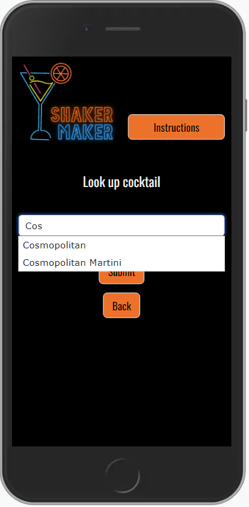
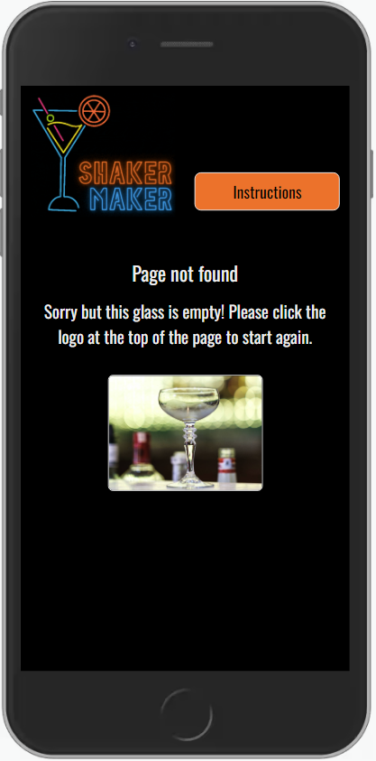

# ShakerMaker Website


This project creates a web-based cocktail finder application called ShakerMaker, allowing users to search cocktail recipes using a variety of methods. It is designed to be responsive and accessible on a range of devices, making it easy to navigate for users.

[View the live project here](https://nicksmith100.github.io/shakermaker/)


## Table of Contents

1. [Project Goals](#project-goals)
2. [Research](#research)
3. [User Stories](#user-stories)
4. [Design](#design)
5. [Features](#features)
6. [Testing](#testing)
7. [Tecnologies Used](#technologies-used)
8. [Deployment](#deployment)
9. [Credits](#credits)


## Project Goals

### Purpose

A web-based cocktail finder application which allows users to search cocktail recipes using a variety of methods.

### Client Goals

This project aims to demonstrate and embed my understanding of JavaScript as part of my personal development. As such there is no specific client, but I have built it with the following goals in mind from a client perspective:

- Create a fun and engaging site which provides users with information about cocktails while generating interest in the topic
- Provide a cocktail finder service which returns results based on selected ingredients 
- Provide a cocktail search service which returns results based on cocktail name
- Provide a random cocktail service which returns a random cocktail recipe

### User Goals

Detailed user stories are provided in the [User Stories](#user-stories) section below, but the primary goals of the user are to:

- Find cocktail recipes
- Understand and use the different search methods offered by the site
   
## Research

### Cocktail recipes

Before embarking on the project I wanted to be sure that I could obtain cocktail recipes from a reliable source, having little knowledge of the subject myself. After some research I discovered [TheCocktailDB](https://www.thecocktaildb.com/) - an open, crowd-sourced database of drinks and cocktails from around the world with a [free JSON API](https://www.thecocktaildb.com/api.php). I conducted some intial testing and determined that the full version of the API would provide the necessary functionality to satisfy the project goals outlined above. (See [JavaScript functionality](#javascript-functionality) section below for more details.)

### Popular ingredients

From my initial testing of the API it became clear that there were a vast number of ingredients provided by the database, such that listing them all for selection would detract from the user experience. I resolved to include only the 12 most popular spirits and the 30 most popular additional ingredients, using the list provided on this website as a guide: [Difford's Guide - Top 100 Cocktail Ingredients](https://www.diffordsguide.com/encyclopedia/1045/cocktails/top-100-cocktail-ingredients).

### Existing cocktail recipe finder websites

I researched existing cocktail recipe finder websites to determine what was already available to potential users of my site. Results included:

- [Difford's Guide - Cocktail Finder](https://www.diffordsguide.com/cocktails/search): A well-presented and sophisticated search engine offering various ways to search, including multiple ingredient dropdowns and the option to search by keyword. The site offers maximum functionality but arguably risks overwhelming less experienced cocktail makers.
- [Cocktail Builder](https://www.cocktailbuilder.com/): Offers a "shopping list" of ingredients, allowing the user to select which ones they have and which they don't. The site provides a live update of cocktails which can be made with the selected ingredients, as well as other cocktails which have one or more ingredients missing. The site offers good functionality with a simple interface and straightforward results, but the styling is quite basic.
- [Epicurious Interactive Cocktail Cabinet](https://www.epicurious.com/recipes-menus/cocktail-recipe-finder-article): Provides an excellent, user-friendly interface with images of spirits and other ingredients to be selected. As ingredients are selected, the interface adapts to indicate which other ingredients remain available for selection using a spider-diagram effect, indicating how many recipes exist with the selected ingredients. Clicking on a recipe title and image opens a new tab with the recipe, seemingly to drive traffic to other parts of the website, which arguably detracts from the user experience.

## User Stories

Based on the research and project goals outlined above, I envisage the site being visited by casual cocktail makers with no expert knowledge, as well as more experienced cocktail makers who know what cocktail they are looking for but wish to confirm the ingredients and method. User stories may differ depending on the experience of the user and whether they are a first-time or returning visitor. 

A. As a casual cocktail maker I want to:
1. Find out what cocktails I can make with the ingredients I have available.
2. Search for cocktails I have heard of and/or tried previously.
3. Discover cocktails I am not already aware of.
  
B. As an experienced cocktail maker I want to:  
1. Remind myself of cocktails which can be made with the ingredients I have available.
2. Search for a particular cocktail recipe to confirm the ingredients and method.
3. Discover cocktails I am not already aware of.
4. Revisit cocktails I have not made recently and may have forgotten about.

C. As a first-time visitor (regardless of experience) I want to:
1. Understand what the site offers
2. Learn how to use the site to find cocktail recipes
3. Easily navigate throughout the site to find the information I need

D. As a returning visitor (regardless of experience) I want to: 
1. Use the site to find various cocktail recipes
2. Explore different methods for finding cocktail recipes

## Design

### Wireframes

Wireframes were created using the Figma platform: [Figma - ShakerMaker](https://www.figma.com/file/kkJOk17MsggqClsHPMeO5I/Shaker-Maker?type=design&node-id=0%3A1&mode=design&t=gZj3N4u4m5Y8Abjo-1).

<details><summary>Desktop wireframes</summary>

  

</details>

<details><summary>Mobile wireframes</summary>

  

</details>

Based on prior experience I decided that desktop and mobile wireframes would be sufficient to keep the overall layout of the site on track, the expectation being that [Bootstrap's grid system](https://getbootstrap.com/docs/5.3/layout/grid/) would provide the responsiveness required at different device breakpoints in between (see [Layout and Styling](#layout-and-styling) section below).

While the overall structure of the site stays true to the wireframes, there are some notable differences in the final layout which came about for design and user experience reasons:

- For design purposes I opted to provide a welcome screen with an animated version of the logo, which disappears after 2 seconds and gives way to the main site.
- I added a header, to provide a space for the logo to maintain consistent branding throughout the user experience, and to provide a space for additional buttons (see below).
- To aid the user experience I added to the header an "Instructions" button, and a "Back to menu" button which appears on the results screen.
- To provide a fun, additional search option I added a random cocktail finder.

### Layout and Styling

The site uses the [Bootstrap 5.3 Grid system](https://getbootstrap.com/docs/5.3/layout/grid/) to ensure it is fully responsive on all device and viewport sizes. Bootstrap 5.3 uses the following [breakpoints](https://getbootstrap.com/docs/5.3/layout/breakpoints/), the shorthand references for which are used throughout the rest of this document:

| Breakpoint        | Shorthand   | Dimensions |
|-------------------|-------------|------------|
| Extra small       | xs          | <576px     |
| Small             | sm          | ≥576px     |
| Medium            | md          | ≥768px     |
| Large             | lg          | ≥992px     |
| Extra large       | xl          | ≥1200px    |
| Extra extra large | xxl         | ≥1400px    |

In addition, the site uses the following specific components from the Bootstrap library:
- [Form classes](https://getbootstrap.com/docs/5.3/forms/overview/) for the cocktail search form.
- [Modal plugin](https://getbootstrap.com/docs/5.3/components/modal/) to display instructions and various alerts.  
- [Spacing](https://getbootstrap.com/docs/5.3/utilities/spacing/) and [typography](https://getbootstrap.com/docs/5.3/content/typography/) utility classes throughout, ensuring the layout and font are appropriate to the device in use. 
- [Display property](https://getbootstrap.com/docs/5.3/utilities/display/) to toggle the visibility of some components at certain breakpoints, in particular:
    -  In the header, hiding the strapline "Find your perfect cocktail" on xs viewports.
    -  On the spirit selection page, displaying images within the buttons on sm viewports and above.

### Imagery

- **Logo**: A neon representation of a cocktail glass on a black backgound, with the name of the site also represented in neon-style lettering. It is provided in bright colours to replicate a typical sign of a cocktail bar. On the welcome screen an animated version of the logo is displayed for a few seconds, while a static version is used in the header to avoid distracting the user. The logo was created using a template by Carla Moreno on the Canva website: [Orange and Blue Neon Drinks Bar Animated Logo](https://www.canva.com/templates/EAFCXIroTmk-orange-and-blue-neon-drinks-bar-animated-logo/).

  <details><summary>Animated logo</summary>
  
  
  
  </details>
  
  <details><summary>Static logo</summary>
  
  
  
  </details>

- **Spirit selection**: Images of relevant spirit bottles are shown on the spirit selection buttons for sm breakpoints and above, provided by [TheCocktailDB API](https://www.thecocktaildb.com/api.php).

- **Cocktail images**: Images of the cocktails themselves are shown on the results page, again provided by [TheCocktailDB API](https://www.thecocktaildb.com/api.php). Since the database is crowd-sourced, these images are submitted by users of the database.

- **404 image**: Carries an image of an empty cocktail glass with an associated message.
       
### Colour Scheme

The colour scheme of the site builds on the main logo, utilising the five fluorescent colours for the various buttons, maintaining the cocktail bar aesthetic.
- **Background**: The site is set on a black (#000000) background which provides the necessary contrast for the bright colours.
- **Primary buttons**: Utilise the orange colour (#f56d1c) from the logo, transitioning to blue (#1498e5) when hovered over, using an ease-in-out transition for a smooth effect.
- **Other buttons**: Use the other colours from the logo - yellow (#dfc706), green (#719d02) and pink (#e01c80). 

<details><summary>Colour scheme palette</summary>


</details>

### Typography

- #### Logo

  The font used in the logo is Neoneon. This was available directly on [Canva](https://www.canva.com/) where the logo was created, and was chosen to complement the neon sign which forms the logo. More information about the font can be found on [Dafont](https://www.dafontfree.co/neoneon-font/), where it is described as "reproducing the 80s style of neon signage".

  <details><summary>Neoneon font</summary>

  

  </details>
  
- #### Main heading

  The main heading "Find your perfect cocktail" uses Exo, imported from [Google Fonts](https://fonts.google.com/specimen/Exo), with Sans Serif as the fallback font. Exo is a stylish but clear font with a rounded form which complements the Neoneon font used in the logo.

  <details><summary>Exo font</summary>

  

  </details>

- #### Other headings, buttons and text

   The rest of the site uses Oswald, imported from [Google Fonts](https://fonts.google.com/specimen/Oswald), with Sans Serif as the fallback font. This is a simple, modern font which ensures that everything can be read clearly while working well with the overall site aesthetic.

  <details><summary>Oswald font</summary>

  

  </details>

- #### Icons

  [Bootstrap Icons](https://icons.getbootstrap.com/) have been used for the main menu buttons, utilised as classes in the `<i>` tag.

  <details><summary>Menu icons</summary>

  
  
  

  </details>
  
- #### Favicon

   The favicon is simply "SM" in the Neoneon font, generated using [Favicon Generator](https://www.favicon-generator.org/). This proved more effective than trying to use the main logo as a favicon, as the detail of it was lost at such a small size.

  <details><summary>Favicon</summary>

  

  </details>

## Features

### Scope

- #### Minimum Viable Product

  To be viable as a cocktail search tool, the website **must have**:
  1. At least one method for searching and returning cocktail recipes.
  2. A source of cocktail recipes to provide reliable results.
  3. An intuitive workflow with supporting guidance.
         
- #### Additional Features (in scope)

  To provide a good user experience and meet the stated client goals, the website **should have**:
  1. Options to find cocktails by popular ingredients, name or random selection.
  2. Images of cocktails provided alongside recipes.
   
- #### Future Ideas (not currently in scope)
  
   To provide a better user experience and better meet the stated client goals, the website also **could have**:
   1. The ability to select any ingredient when searching by ingredient (not limited to most popular ingredients).
   2. A cocktail quiz which allows users to guess which ingredients are included in a given cocktail.
   3. An option to select "non-alcoholic" at the spirit selection stage when searching by ingredients.

### Page Elements and Interaction

The website is presented as a single page with elements which are displayed or hidden based on user interaction, in line with the scope outlined above. All pages utilise Bootstrap's [Grid system](https://getbootstrap.com/docs/5.3/layout/grid/), ensuring that the page is fully responsive to viewport size.

- #### Welcome page

  The site displays an animated version of the logo for 2 seconds, before automatically giving way to the header and main menu.

- #### Header

  Apart from the welcome page, all pages include a header with a static version of the logo on the left-hand side and a button menu on the right-hand side. The button menu initially includes only an "Instructions" button, which on being pressed displays a modal offering guidance on how to use the various search options. The header also includes a heading "Find your perfect cocktail", which is hidden for xs viewports.
         
  <details><summary>Header (lg)</summary>
      
  

  </details>
    
  <details><summary>Header (md)</summary>
      
  

  </details>
    
  <details><summary>Header (sm)</summary>
      
  

  </details>

  <details><summary>Instructions modal</summary>

  

  </details>
    
- #### Main menu

  The main menu provides three large buttons displaying different search options, with appropriate [Bootstrap icons](https://icons.getbootstrap.com/):
  - Search by ingredients (with a shopping basket icon)
  - Look up cocktail (with a magnifying glass icon)
  - Surprise me (with a dice icon)

  <br>
  <details><summary>Main menu (lg)</summary>
         
  

  </details>

  <details><summary>Main menu (md)</summary>
         
  

  </details>
      
  <details><summary>Main menu (xs)</summary>
         
  

  </details>
      

      
- #### Search by ingredients
  - ##### Select a Spirit
        
    Selecting "Search by ingredients" takes the user to a spirit selection page, allowing the user to select one of 12 spirits. The spirit selection buttons are presented with images of spirit bottles on sm viewports and above, and as simple text buttons on xs viewports. The background of the button turns from yellow to green when selected. Navigation buttons at the bottom of the page allow the user to proceed or go back. An alert modal is displayed if the user tries to proceed with no spirit button selected.

    <details><summary>Spirit selection (lg)</summary>

    

    </details>

    <details><summary>Spirit selection (xs)</summary>

    

    </details>
    
    <details><summary>No spirit alert</summary>

    

    </details>

  - ##### Select additional ingredients
    
    The next page allows the user to select 1-3 additional ingredients. The buttons are presented as simple text buttons on all viewports, the background of the button turning from yellow to green when selected. Buttons at the bottom of the page allow the user to search based on the selected ingredients or go back. An alert modal is displayed if the user tries to proceed with no ingredient button selected, or if the user attempts to select more than three additional ingredients.

    <details><summary>Ingredients selection (lg)</summary>

    

    </details>

    <details><summary>Ingredients selection (xs)</summary>

    

    </details>
    
    <details><summary>No ingredient alert</summary>

    

    </details>

    <details><summary>Max ingredients alert</summary>

    

    </details>

  - ##### Results

    The results page displays all cocktails matching the selected ingredients, as names and images. As multiple results are expected, recipes are initially hidden but can be revealed by clicking on the photograph. Positioning of recipes is dependent on device size, with the direction of the reveal animation adjusted accordingly. The results page also includes an additional "Back to menu" button in the header.

    <details><summary>Search by ingredients - results (lg)</summary>

    

    </details>

    <details><summary>Search by ingredients - results (xs)</summary>

    
    

    </details>
    <br>

    If no exact matches are found then the user is informed and presented with a selection of popular cocktails instead.

    <details><summary>Search by ingredients - no results (lg)</summary>

    

    </details>

    <details><summary>Search by ingredients - no results (xs)</summary>

    

    </details>
   

- #### Look up cocktail
  - ##### Search form

    Selecting "Look up cocktail" displays a simple form, allowing the user to enter the name of a cocktail. The form forces selection from an autocomplete list, ensuring that only cocktails which exist in the database can be entered into the form, preventing nil results. Buttons beneath the form allow the user to search or go back.

    <details><summary>Look up cocktail (lg)</summary>

    
    
    </details>

    <details><summary>Look up cocktail (xs)</summary>
    
    

    </details>
 
  - ##### Results

    The results page displays the cocktail(s) matching the search term, as name(s) and image(s). As usually only a single result is expected, the recipe is automatically revealed as the results page is revealed. Positioning of the recipe is dependent on device size, with the direction of the reveal animation adjusted accordingly. The results page also includes an additional "Back to menu" button in the header.

    <details><summary>Look up cocktail - results (lg)</summary>

    
    
    </details>

    <details><summary>Look up cocktail - results (xs)</summary>
    
    

    </details>

- #### Random search (Surprise me!)

  Selecting "Surprise me!" takes the user straight to the results page, where they are presented with a random cocktail, displayed as a name and image. As only a single result is provided, the recipe is automatically revealed as the results page is revealed. Positioning of the recipe is dependent on device size, with the direction of the reveal animation adjusting accordingly. The results page also includes an additional "Back to menu" button in the header.

  <details><summary>Random result (lg)</summary>

  
    
  </details>

  <details><summary>Random result (xs)</summary>
    
  

  </details>

- #### Database Error Modal

  An alert modal is displayed if the database cannot be reached or returns an error. This includes a "Close page" button which closes the whole page rather than just the modal itself.

  <details><summary>Database error modal</summary>
    
  

  </details>

- #### 404 page

  A 404 page is provided in the event that the user browses to a page which does not exist. It depicts an empty cocktail glass with associated text.

  <details><summary>404 page (lg)</summary>
    
  

  </details>

  <details><summary>404 page (xs)</summary>
    
  

  </details>    

### JavaScript Functionality

- #### Presentation and navigation

   - The [jQuery](https://jquery.com/) [show and hide methods](https://www.w3schools.com/jquery/jquery_hide_show.asp) have been used to allow various page elements to be revealed and hidden. The [Drop effect](https://www.tutorialspoint.com/jquery/effect-drop.htm) is used in most cases to add style to the transitions.
     
   - The [jQuery](https://jquery.com/) [fadeIn](https://api.jquery.com/fadeout/) and [fadeOut](https://api.jquery.com/fadeout/) effects have been applied to the "Back to menu" button in the header.
   
   - EventListeners have been used to add functionality to various elements, including buttons and cocktail images (where necessary to allow the reveal of recipes). 

- #### API and associated functionality

  The site utilises [TheCocktailDB API](https://www.thecocktaildb.com/api.php) to provide all information regarding cocktails. In particular:

   - ##### Search by ingredients
     - An XML HttpRequest is used to pull a full list of ingredients from the API. A function selects a subset of these ingredients to provide the list of spirits available for selection, and creates the associated buttons (including images for sm viewports and above). A similar process is used to create the list of additional ingredients available for selection and the associated buttons.
     - The properties of selected buttons are read to create a search string which is submitted to the API to get results, each in the form of a cocktail name, a photograph and a unique ID.
     - The unique ID of each cocktail is submitted to the API to get the list of ingredients and method which form the recipe.
     - If no matches are found then the API's in-built functionality is used to provide a list of popular cocktails instead.

   - ##### Look up cocktail 
     - An XML HttpRequest is used to pull a full list of cocktail names from the API, pushing them to an array.
     - The search form includes an [autocomplete function from jQuery UI](https://jqueryui.com/autocomplete/) which uses the array of cocktail names as its basis, avoiding nil results.
     - The search term is submitted to the API to get the details of the cocktail.

   - ##### Random search (Surprise me!)
      - The API's in-built functionality is used to get details of a random cocktail.

## Testing

### Automated testing

- #### HTML validation with [W3C Markup Validator](https://validator.w3.org/)

  | **Error/Warning**         | **Offending code**           | **Fix**                                                                              |
  |---------------------------|-----------------------------|--------------------------------------------------------------------------------------|
  | Warning: Sections lacking headings | Various sections throughout | - Change welcome screen from ```<section>``` to ```<div>```<br>- Add ```<h2>``` headings to all other sections |


  The current HTML returns **no errors or warnings**.

- #### CSS validation with [W3C CSS Validator](https://jigsaw.w3.org/css-validator/)

  | **Error/Warning**         | **Offending code**           | **Fix**                                                                              |
  |---------------------------|-----------------------------|--------------------------------------------------------------------------------------|
  | Warning: Vendor extensions | ```-moz-transition```<br>```-webkit-transition``` | Delete vendor extensions (since they are obsolete anyway) |  
  
  The current CSS returns **no errors or warnings**.

- #### JavaScript validation using [JSHint](https://jshint.com/)

  | **Error/Warning**                                                                                                                       | **Offending code**                                                                                                                          | **Fix**                                                                                                                                                                                                                                |
  |-----------------------------------------------------------------------------------------------------------------------------------------|---------------------------------------------------------------------------------------------------------------------------------------------|----------------------------------------------------------------------------------------------------------------------------------------------------------------------------------------------------------------------------------------|
  | Unnecessary semicolons                                                                                                                  | 5 lines, throughout code                                                                                                                    | Remove unnecessary semicolons                                                                                                                                                                                                          |
  | Creating global 'for' variable                                                                                                          | 5 lines, e.g. ```for (i of indices)```                                                                                                      | Declare variables with "let", e.g. ```for (let i of indices)```                                                                                                                                                                        |
  | Undefined variables                                                                                                                     | Throughout, e.g. ```for (i = 0; i < topIngs.length; i++)```                                                                                 | Declare variables with "let", e.g. ```for (let i = 0; i < topIngs.length; i++)```                                                                                                                                                      |
  | Function declarations should not be placed in blocks. Use a function expression or move the statement to the top of the outer function. | ```writeResults()``` function, within ```$("#i-search-button").click(function () {})``` block                                               | ```writeResults()``` function moved to top of outer function                                                                                                                                                                           |
  | Functions declared within loops referencing an outer scoped variable may lead to confusing semantics. (ingArray, i)                     | Line 247:<br>  ``` getData(ingredientListURL, function (data) { data = data.drinks; ingArray.push(data[i].strIngredient1); }); ```              | I am satisfied that the code is semantically clear, so no change made (noting this is only a warning, not an error).                                                                                                                   |
  | Functions declared within loops referencing an outer scoped variable may lead to confusing semantics. (maxIngredientsAlert)             | Line 366:<br>  ``` i.addEventListener("click", function () {  [...]  if (this.classList.contains("btn-yellow")) { maxIngredientsAlert(); }  ``` | Can be resolved by replacing the call to ```maxIngredientsAlert()``` with the contents of the function. However, this would appear to be more confusing semantically, so no change made (noting this is only a warning, not an error). |
  
  The current JavaScript returns **no errors** and **no warnings** apart from those acknowledged above.

- #### Accessibility using [Lighthouse accessibility](https://developer.chrome.com/docs/lighthouse/accessibility/)

  Lighthouse audit scores (accessed through Chrome DevTools) show that the site is fully accessible and complies with best practices.

  <details><summary>Lighthouse scores</summary>

  

  </details>

### Manual Testing

- #### User stories

  The site was tested against the user stories as follows. (See [User story screenshots](#user-story-screenshots) below table for associated screenshots.)

  | **User Goal**                                                                          | **How it is achieved**                                                                                                                                                                                                                                                                                                                                                           |
  |----------------------------------------------------------------------------------------|----------------------------------------------------------------------------------------------------------------------------------------------------------------------------------------------------------------------------------------------------------------------------------------------------------------------------------------------------------------------------------|
  | _A. As a casual cocktail maker I want to:_                                             |                                                                                                                                                                                                                                                                                                                                                                                  |
  | 1. Find out what cocktails I can make with the ingredients I have available.           | The "Search by ingredients" function allows the user to select a base spirit and up to three additional ingredients, providing a list of cocktails which include those ingredients.                                                                                                                                                                                            |
  | 2. Search for cocktails I have heard of and/or tried previously.                       | The "Look up cocktail" function allows the user to search for cocktails by name, and the autocomplete functionality means that cocktails can be found with partial matches if the user does not remember the exact name.                                                                                                                                                         |
  | 3. Discover cocktails I am not already aware of.                                       | The "Surprise me!" function returns a random cocktail. In addition, if a search by ingredients does not match any results then a selection of popular cocktails are returned instead.                                                                                                                                                                                            |
  | _B. As an experienced cocktail maker I want to:_                                       |                                                                                                                                                                                                                                                                                                                                                                                  |
  | 1. Remind myself of cocktails which can be made with the ingredients I have available. | The "Search by ingredients" function allows the user to select a base spirit and up to three additional ingredients, providing a list of cocktails which include those ingredients. |
  | 2. Search for a particular cocktail recipe to confirm the ingredients and method.      | The "Look up cocktail" function allows the user to search for cocktails by name.                                                                                                                                                                                                                                                                                                 |
  | 3. Discover cocktails I am not already aware of.                                       | The "Surprise me!" function returns a random cocktail. In addition, if a search by ingredients does not match any results then a selection of popular cocktails are returned instead.                                                                                                                                                                                            |
  | 4. Revisit cocktails I have not made recently and may have forgotten about.            | As above. In addition, when looking up cocktails by name, the autocomplete feature allows for partial matches, allowing the user to browse by cocktail types (e.g. "martini", "sour").                                                                                                                                                                                          |
  | _C. As a first-time visitor (regardless of experience) I want to:_                     |                                                                                                                                                                                                                                                                                                                                                                                  |
  | 1. Understand what the site offers                                                     | The user is presented with a clear, intuitive menu. If in any doubt, instructions are available at the click of a button.                                                                                                                                                                                                                                                        |
  | 2. Learn how to use the site to find cocktail recipes                                  | Instructions are available at the click of a button which fully explain how each search option works. The "Search by ingredients" and "Look up cocktail" options also include helpful cues and reminders to guide the user through the process.                                                                                                                                  |
  | 3. Easily navigate throughout the site to find the information I need                  | Navigation is intuitive and the site includes helpful cues and reminders to guide the user through the process of searching for cocktails. The "Instructions" button is clear, and a "Return to menu" button is presented on the results page, making it easy to start again.                                                                                                    |
  | _D. As a returning visitor (regardless of experience) I want to:_                      |                                                                                                                                                                                                                                                                                                                                                                                  |
  | 1. Use the site to find various cocktail recipes                                       | The database provides access to 627 cocktail recipes, allowing for a wide range of cocktail recipes to be discovered. The intuitive navigation makes repeated searching easy.                                                                                                                                                                                                    |
  | 2. Explore different methods for finding cocktail recipes                              | The site provides three very different options for finding cocktail recipes. The simple interface and clear instructions make it easy to explore these different methods.|

- #### User story screenshots

  Screenshots are shown for xs viewports (i.e. mobile devices) because this is how the majority of users are expected to access the site. Screenshots for lg viewports (tablets, laptops and desktops) can be found in the [Features](#features) section. 

  - ##### Search by ingredients

    <details><summary>Search by ingredients - spirit selection</summary>

    

    </details>

    <details><summary>Search by ingredients - additional ingredients</summary>

    

    </details>
    
    <details><summary>Search by ingredients - matches found</summary>

     

    </details>

    <details><summary>Search by ingredients - no matches found</summary>
    
    

    </details>


  - ##### Look up cocktail

    <details><summary>Look up cocktail - search form</summary>

    

    </details>

    <details><summary>Look up cocktail - results</summary>

    

    </details>

  - ##### Surprise me!

    <details><summary>Surprise me!</summary>

    

    </details>

  - ##### Navigation and instructions

    <details><summary>Site navigation</summary>

    

    </details>

    <details><summary>Instructions</summary>

    

    </details>

- #### Feature testing

  | **Feature**                                    | **Expected outcome**                                                                                                                                                                                                                              | **Actual outcome** (tested on various devices and Chrome Dev Tools) | **Result** |
  |------------------------------------------------|---------------------------------------------------------------------------------------------------------------------------------------------------------------------------------------------------------------------------------------------------|---------------------------------------------------------------------|------------|
  | Responsive design                              | Site layout is fully responsive to device and viewport size                                                                                                                                                                                       | Site layout is fully responsive                                     | Pass       |
  | Welcome screen                                 | Animated logo displayed for 2 seconds before sliding upwards, then header and main menu slide downwards                                                                                                                                           | Expected animation occurs                                           | Pass       |
  | Header: logo                                   | Clicking header logo takes user back to welcome screen                                                                                                                                                                                            | Expected navigation occurs                                          | Pass       |
  | Header: "Find your perfect cocktail" heading   | Disappears at xs viewport size                                                                                                                                                                                                                    | Heading disappears                                                  | Pass       |
  | Header: "Instructions" button                  | Clicking button displays modal with instructions                                                                                                                                                                                                  | Instructions modal is displayed                                     | Pass       |
  | Header: "Back to menu" button                  | Results page slides out to left, main menu slides in from left, "Back to menu" button fades out                                                                                                                                                   | Expected animation occurs                                           | Pass      |
  | Main menu                                      | Main menu buttons change opacity and font colour turns white on hover                                                                                                                                                                             | Expected hover effect occurs                                        | Pass       |
  | Main menu: "Search by ingredients" button      | Main menu slides out to left, spirit selection page slides in from left                                                                                                                                                                           | Expected animation occurs                                           | Pass       |
  | Main menu: "Look up cocktail" button           | Main menu slides out to left, cocktail search form slides in from left                                                                                                                                                                            | Expected animation occurs                                           | Pass       |
  | Main menu: "Surprise me!" button               | Main menu slides out to left, results page slides in from left, "Back to menu" button slides in                                                                                                                                                   | Expected animation occurs                                           | Pass       |
  | Spirit selection page                          | Twelve most popular spirits retrieved from API and displayed as buttons                                                                                                                                                                           | Buttons displayed                                                   | Pass       |
  | Spirit selection page: spirit buttons          | Images of spirit bottles displayed on buttons at sm breakpoints and above                                                                                                                                                                         | Images displayed at sm breakpoints and above                        | Pass       |
  | Spirit selection page: spirit buttons          | Background colour turns green and font colour turns white on selection                                                                                                                                                                            | Selected button turns green with white text                         | Pass       |
  | Spirit selection page: spirit buttons          | Clicking a different spirit selection button deselects currently selected button                                                                                                                                                                  | Selected button styling switches to newly selected button           | Pass       |
  | Spirit selection page: "Back" button           | Spirit selection page slides out to left, main menu slides in from left                                                                                                                                                                           | Expected animation occurs                                           | Pass       |
  | Spirit selection page: "Next button"           | If no spirit has been selected, modal is displayed asking user to select a spirit                                                                                                                                                                 | Alert modal is displayed                                            | Pass       |
  | Spirit selection page: "Next button"           | If a spirit has been selected, spirit selection page slides out to left, ingredients selection page slides in from left                                                                                                                           | Expected animation occurs                                           |  Pass      |
  | Ingredients selection page                     | 30 most popular ingredients retrieved from API and displayed as buttons                                                                                                                                                                           | Buttons displayed                                                   | Pass       |
  | Ingredients selection page: ingredient buttons | Background colour turns green and font colour turns white on selection                                                                                                                                                                            | Selected button turns green with white text                         | Pass       |
  | Ingredients selection page: ingredient buttons | Clicking already selected button deselects it                                                                                                                                                                                                     | Button is deselected                                                | Pass       |
  | Ingredients selection page: ingredient buttons | If more than three buttons selected, alert modal is displayed explaining that maximum number of ingredients is three                                                                                                                              | Alert modal is displayed                                            | Pass       |
  | Ingredients selection page: "Back" button      | Ingredients selection page slides out to left, spirit selection page slides in from left                                                                                                                                                          | Expected animation occurs                                           | Pass       |
  | Ingredients selection page: "Next" button      | If no ingredient has been selected, alert modal is displayed asking user to select at least one additional ingredient                                                                                                                             | Alert modal is displayed                                            | Pass       |
  | Ingredients selection page: "Next" button      | If at least one ingredient has been selected, ingredient selection page slides out to left, results page slides in from left, "Back to menu" button fades in                                                                                      | Expected animation occurs                                           | Pass       |
  | Results page (search by ingredients)           | If any cocktails are found matching the selected spirit and ingredients, displays text "Here are all the cocktails you can make with [selected spirit] and [selected ingredients]"                                                                | Text is displayed                                                   | Pass       |
  | Results page (search by ingredients)           | For each match, the name of the cocktail and a photo of it are displayed                                                                                                                                                                          | Cocktail names and photos are displayed                             | Pass       |
  | Results page (search by ingredients)           | If no matches are found, displays text "Sorry, no drinks were found with [selected spirit] and [selected ingredients]. Please try again, or browse our most popular cocktails below instead." followed by a list of popular cocktails with photos | Expected text and content is displayed                              | Pass       |
  | Results page (search by ingredients)           | Clicking on a cocktail photo reveals its list of ingredients and a method                                                                                                                                                                         | Expected animation occurs                                           | Pass       |
  | Look up cocktail page                          | Search form is displayed with placeholder text "Start typing"                                                                                                                                                                                     | Search form is displayed                                            | Pass       |
  | Look up cocktail: search input                 | Typing into search input box displays autocomplete list of cocktail names                                                                                                                                                                         | Autocomplete list is displayed                                      | Pass       |
  | Look up cocktail: search input                 | If user selects item from autocomplete list, it is entered into search input box                                                                                                                                                                  | Selected item is entered into search input box                      | Pass       |
  | Look up cocktail: search input                 | If user clicks outside search input box or autocomplete list, search input is deleted                                                                                                                                                             | Search input is deleted                                             | Pass       |
  | Look up cocktail: "Back" button                | Search form slides out to left, main menu slides in from left                                                                                                                                                                                     | Expected animation occurs                                           | Pass       |
  | Look up cocktail: "Submit" button              | If item from autocomplete list is not present in search input box, alert modal is displayed asking user to select an item from the list                                                                                                           | Alert modal is displayed                                            | Pass       |
  | Look up cocktail: "Submit" button              | If item from autocomplete list is present in search input box, search form slides out to left, results page slides in from left, "Back to menu" button fades in                                                                                   | Expected animation occurs                                           | Pass       |
  | Results page (look up cocktail)                | Displays text "Here's the recipe for [selected item]", followed by the name of the cocktail with a photo                                                                                                                                          | Expected text and content is displayed                              | Pass       |
  | Results page (look up cocktail)                | The cocktail's list of ingredients and method are automatically revealed                                                                                                                                                                          | Expected animation occurs                                           | Pass       |
  | Results page (surprise me)                     | Displays text "Here's a random cocktail for you try!" followed by the name of the cocktail with a photo                                                                                                                                           | Expected text and content is displayed                              | Pass       |
  | Results page (surprise me)                     | The cocktail's list of ingredients and method are automatically revealed                                                                                                                                                                          | Expected animation occurs                                           | Pass       |
  | Database error alert                           | If database call returns error, alert modal is displayed informing user that the database could not be reached and asking them to try again later                                                                                                 | Alert modal is displayed (tested by adding typo to database call)   | Pass       |
  | Database error alert: "Close page" button      | Clicking "Close page" button closes the entire page                                                                                                                                                                                               | Closes entire page                                                  | Pass       |
  | Favicon      | Favicon is displayed in browser tab                                                                                                                                                                                               | Favicon displays correctly                                                  | Pass       |
  | Favicon      | Saving page to mobile homescreen displays favicon as icon                                                                                                                                                                                               | Favicon displayed as icon                                                  | Pass       |
  | 404 page      | Entering incorrect address displays 404 page page                                                                                                                                                                                               | 404 page is displayed                                                  | Pass       |
  | Console      | No errors displayed in console                                                                                                                                                                                               | Only error relates to Permissions-Policy header which can be safely ignored (see [Error with Permissions-Policy header](#error-with-permissions-policy-header))                                                  | Pass       |
    

- #### Browser and device compatibility

  The above features were tested on the following browsers and devices:

  | Browser        | Version                                  | Device                                      | Operating Sytem       | Results                                                        |
  |----------------|------------------------------------------|---------------------------------------------|-----------------------|----------------------------------------------------------------|
  | Firefox        | 116.0.3 (64-bit)                         | Dell Latitude E6420 laptop                  | Windows 10 Home       | Fully functional                                               |
  | Google Chrome  | 116.0.5845.98 (Official Build) (64-bit) | Dell Latitude E6420 laptop                  | Windows 10 Home       | Fully functional            |
  | Google Chrome  | 116.0.5845.92                           | Samsung Galaxy S9 SM-G960F                        | Android 10            | Fully functional            |
  | Google Chrome         | 116.0.5845.103                                     | Apple iPad Pro (12.9-inch) (4th generation)         | iPadOS 16.3.1            | Fully functional |
  | Microsoft Edge | 116.0.1938.54 (Official build) (64-bit)  | Dell Latitude E6420 laptop                  | Windows 10 Home       | Fully functional           |
  | Safari         | 16.3.1                                   | Apple iPad Pro (12.9-inch) (4th generation) | iPadOS 16.3.1         | Fully functional |

  In addition, I asked a number of friends and family members to test the website on their devices, with only one bug reported (see below).

### Bugs and fixes

- #### Empty page when selecting "Search by ingredients"

  During development, I noticed that if "Search by ingredients" was selected and followed through to the results page, and then "Return to menu" was selected and then "Search by ingredients" was selected again, no buttons would be displayed.

  <details><summary>Empty page bug</summary>

  

  </details>

  This was caused by the the whole "search-ingredients" section being hidden when moving from the "select ingredients" page to the results page.

  **Fix:** Hide only the "select-ingredients" div when moving from the "select ingredients" page to the results page.

  <details><summary>Empty page fix</summary>


    ```
    function searchIngredientsToResults() {
      $("#select-ingredients").hide("drop", function () {

          // Reset innerHTML of "spirit-buttons" and "ing-buttons" to avoid potential duplication
          spiritBtnsDiv.innerHTML = "";
          ingBtnsDiv.innerHTML = "";

          $("#results").show("drop");
          $("#results-back").fadeIn();
      }
      );
    }
    ```
  </details>

- #### Multiple spirit and ingredient buttons

  Once the empty page bug was fixed, I noticed that if "Search by ingredients" was selected, and then either "Return to menu" or the "Back" buttons were used and then "Search by ingredients" was selected again, multiple sets of spirit and ingredients buttons would be created.

  <details><summary>Multiple spirit buttons bug</summary>

  

  </details>

  <details><summary>Multiple ingredients buttons bug</summary>

  

  </details>

  **Fix:** Ensure the divs holding the spirit buttons and the ingredients buttons are cleared of content whenever the "Back to menu" or "Back" buttons are used, e.g.:

  <details><summary>Multiple buttons fix</summary>

    ```
    function searchIngredientsToResults() {
      $("#select-ingredients").hide("drop", function () {

          // Reset innerHTML of "spirit-buttons" and "ing-buttons" to avoid potential duplication
          
          spiritBtnsDiv.innerHTML = "";
          ingBtnsDiv.innerHTML = "";

          $("#results").show("drop");
          $("#results-back").fadeIn();
      });
    }
    ```
  </details>

- #### No database content on specific device

  One test user reported that no ingredients or search results could be retrieved using any method. They were using Chrome 115.0.5790.166 on a Moto G31(W) phone running Android 11. Suspecting this to be a database issue I asked them to try again later, using Incognito mode in case any content was cached, but they got the same result. I was unable to replicate this issue and all other test users reported full functionality.

- #### Error with Permissions-Policy header

  When accessed on GitHub pages, the console displays the following error:

  ```Error with Permissions-Policy header: Origin trial controlled feature not enabled: 'interest-cohort'.```

  This appears to be shown because GitHub pages blocks Google's new FLoC (alternative to cookies) technology, as detailed here: [Error with Permissions-Policy header](https://bobbyhadz.com/blog/error-with-permissions-policy-header-unrecognized-feature).

  I have attempted to avoid this error by adding the following code to the head of each HTML page, but to no avail. In any event, the error can be safely ignored as detailed in the link above.
  
  ```<meta http-equiv="Permissions-Policy" content="interest-cohort=()">```

## Technologies Used

### Languages
- [HTML](https://html.spec.whatwg.org/multipage/)
  - Standard markup language for web pages
- [CSS](https://www.w3.org/Style/CSS/)
  - Adding style to HTML
- [JavaScript](https://www.w3schools.com/js/)
  - Adding interactive elements

### Frameworks
- [Bootstrap 5.3](https://getbootstrap.com/docs/5.3/getting-started/introduction/)
  - Overall layout and styling, and specific components as described above

### Libraries
- [jQuery](https://jquery.com/)
  - Show and hide functionality
- [jQuery UI](https://jqueryui.com/)
  - Autocomplete on search form
- [Google Fonts](https://fonts.google.com)
  - Exo and Oswald fonts
- [Bootstrap icons](https://icons.getbootstrap.com/)
  - Icons on main menu buttons

### APIs
- [TheCocktailDB API](https://www.thecocktaildb.com/api.php)
  - All cocktail information including spirit names, ingredient names and results (including cocktail photographs)

### Platforms
- [Github](https://github.com/)
  - Storing code and deployment
- [CodeAnywhere](https://app.codeanywhere.com/)
  - IDE used for majority of project development
- [Gitpod](https://gitpod.io/)
  - IDE used to finalise project (due to technical issues with CodeAnywhere)

### Other Tools
- [Figma](https://www.figma.com/)
  - Wireframes
- [Coolors](https://coolors.co/)
  - Colour palette
- [Favicon Generator](https://www.favicon-generator.org/)
  - Website favicon
- [Am I Responsive](https://ui.dev/amiresponsive)
  - Montage of different devices displaying the site
- [Canva](https://www.canva.com/)
  - Creation of main logo
- [Unsplash](https://unsplash.com/)
  - 404 image
- [Fix the photo](https://fixthephoto.com/uk/online-gimp.html)
  - Image editing
  

## Deployment

### GitHub Pages

The project was deployed to GitHub Pages using the following steps.

1. Log in to GitHub and locate the [GitHub Repository](https://github.com/nicksmith100/shakermaker/)
2. At the top of the Repository (not top of page), locate the "Settings" Button on the menu.
3. In the menu on the left-hand side, under "Code and automation", select "Pages".
4. Under "Source", click the dropdown which says "None" and select "main", then click "Save".
5. Refresh the page if it does not do so automatically.
6. A link to the published site will appear at the top of the page.

## Credits

### Code

- [Bootstrap 5.3](https://getbootstrap.com/docs/5.3/layout/grid/): Bootstrap Library used throughout the project, including responsive layout and specific components as outlined above.
- All other code snippets are credited in comments in the relevant files.

### Content

- All information regarding cocktails, including names and recipes: [TheCocktailDB API](https://www.thecocktaildb.com/api.php).
- All other content was written by the developer.

### Media

- Logo: [Carla Moreno on Canva](https://www.canva.com/templates/EAFCXIroTmk-orange-and-blue-neon-drinks-bar-animated-logo/)  
- Cocktail images and spirit bottle images: [TheCocktailDB API](https://www.thecocktaildb.com/api.php)
- 404 image: [Engin Akyurt on Unsplash](https://unsplash.com/photos/1BwfhAJkTD4)     

### Acknowledgements

- My Mentor [Rory Patrick Sheridan](https://github.com/Ri-Dearg) for many helpful pointers.
- Our Cohort Facilitator [Iris Smok](https://github.com/Iris-Smok/Iris-Smok) for providing helpful guidance on project requirements throughout.
- [Emma Hewson](https://github.com/emmahewson) whose [Travel Personality Quiz](https://github.com/emmahewson/mp2_travel_quiz/tree/main) project has provided much inspiration!
